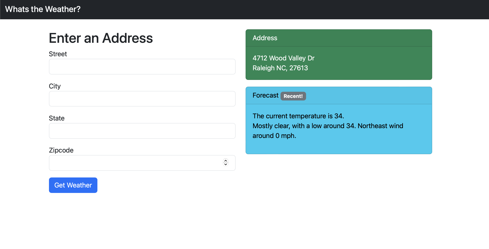

# What's the Weather?

**What's the Weather** is a an app that returns the temperature and weather forecast from an address.
It's written with Ruby on Rails and the only extra gems installed are:
- **geocoder** - for getting the latitude and longitude from the Address street and zipcode.
- **httparty** - for making api calls to the weather service to return forecast and temperature.
- **pry** - for looking at the guts.

## How it works
1. The action starts for **What's the Weather** when the user fills out an address form.
2. Rails handles the `@address` object as normal.
3. The` AddressController` calls a service object which determines which adapter (currently, `UsWeatherAdapter`) will get the weather data
4. `Address#create` takes the data from the service object to build a `weather` instance for the `address`
5. On successful save, `address` and `weather` are then displayed on the `Address#show` page along with a form for a new address.
6. A 30 minute cookie is used to store recent addresses' zipcodes which points to their weather forecast and toggles a "recent" badge on the UI
7. This app only uses `Address#new`, `Address#show` and `Address#create` actions for the user facing pages. All the others are reserved for admin duties.

## How the `UsWeatherAdapter` works
1. User fills out the form
2. The address `zipcode` and `street` are used to get the address latitude and longitude.

        before_validation :geocode

3. The latitude and longitude are used to call an API to get the data needed to get weather area coordinates

        HTTParty.get("https://api.weather.gov/points/#{lat_lang.first},#{lat_lang.last}", headers: { 
                "Accept" => "application/json" 
            })

4. The coordinates are used to get the weather data to populate a `weather` instance 

        HTTParty.get("https://api.weather.gov/gridpoints/#{grid["cwa"]}/#{grid["gridX"]},#{grid["gridY"]}/forecast", headers: { 
                "Accept" => "application/json" 
            })

5. The output is a hash: `{ temperature: Integer, forecast: String }`

## The Future!
1. An adapter is used that calls the weather.gov API which is US only, so future adapters can be added for international addresses.
2. Rails scaffold was used to create the Address class. This is so the unused actions will be in place for implementing an adminstration area.
3. Presenters are used to make messages to the UI as close to final form as possible to facilitate adding a frontend framework.
4. Internationalization & Accessbility!

## Technical Details

* Ruby version: 3.0.0
* Rails version: 7.0.4.2
* Bootstrap version: 5.3.0

## Known Issues
- Some bogus addresses are generating `geocode lat/long` which results in a `weather` association with adapter that results as an `Integer` instead of a `Hash`. This causes `Address#create` to fail.
